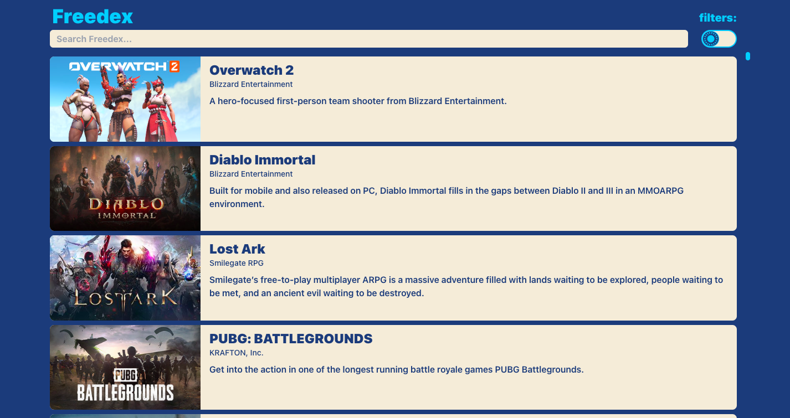

# **Freedex**
## Index for Free-To-Play videogames
An application that utitlize a third party api, the FreeToGame API, to create an index of free games that the user can play. The user can search for games in the index, filter the index by platform and/or genre, and sort the index. When a game is clicked on information about the game is displayed along with a link to a location to play the game. If the user is unsure about what game they are looking for, under the selected game information the is a button to choose a random game. 

## Technology used in development
React.js | HTML/JSX | SCSS | Tailwind CSS | third party api (FreeToGame API)

## Current Issues
- The index will automatically scroll to the top on smaller screens
- On some devices require multiple clicks to open the game information 

# [**Go to Freedex**](https://freedex.netlify.app/)

